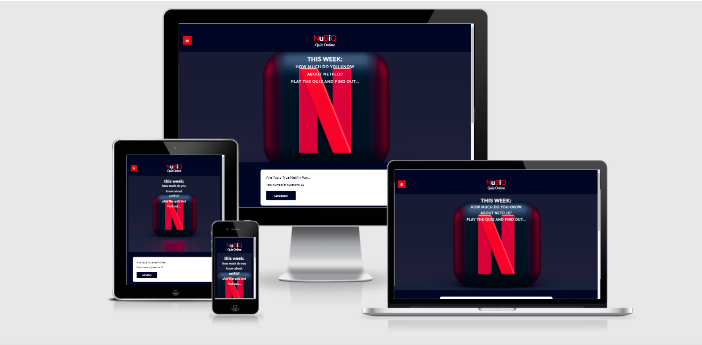

<h1 align="center">NuBiQ | Quiz Online</h1>

[View the live project here.](https://ellis882.github.io/NuBiQ-quiz-online-mp2/)

This is a fictional website designed to engage the user in a unique and fun way and connect them with NuBiQ to play an online quiz every week. They can subscribe to stay updated with the current events of NuBiQ and use the social media links to stay connected with the company. 

## User Experience (UX)

-  ### User stories

    -   #### First Time Visitor Goals

        1. As a First Time Visitor, I want to play a fun online quiz to test my knowledge about Netflix.
        2. As a First Time Visitor, I want to be able to easily navigate throughout the site to play the quiz.
    
    -   #### Returning Visitor Goals

        1. As a Returning Visitor, I want to play a new fun quiz.
        2. As a Returning Visitor, I want to stay connected through the social media links.
    
    -   #### Frequent User Goals
        1. As a Frequent User, I want to sign up to the Newsletter to stay updated with the current events of NuBiQ.
        

    -   #### Owners Goals
        1. As a Owner, I want to make an online quiz that visitors can play for fun.
        2. As a Owner, I want to provide an entertaining quiz for visitors to test their knowledge about Netflix.
        3. As a Owner, I want to make a good working quiz so that the visitor comes back to play more.
        4. As a Owner, I want to provide social media links to stay connected.
        5. As a Owner, I want to keep the visitor updated with new quizzes and current events.

-  ### Design

    -   #### Colour Scheme
        -   The two main colours used are Red and Dark Blue. Had used white and a little bit of Purple color for contrast.

    -   #### Typography
        -   The Lato font is the main font used throughout the whole website with Sans Serif as the fallback font in case for any reason the font isn't being imported into the site correctly. Lato means 'Summer' in Polish. It is easy and clear to read and belongs to the three most popular font sizes used.

    -   #### Imagery
        -   Imagery is important. The large, background hero image is designed to be striking and to catch the user's attention. The big red N and dark Blue background are catching for the eye.

*  ### Wireframes

    -   Wireframes Desktop, Tablet and Mobile - [View](wireframes/wireframes-milestone-project-2.pdf)
 

## Features

-   Collapsed sidebar where you can link to the different sections of the page and Logo.

-   The Landing page with a picture and text which quiz topic you can play.

-   Three different boxes to play the quiz:
     The first is the Start box where you can start to play and see how many questions you need to answer. 
     The second box is where you answer the questions with the options and the little circles to see how many right and wrong you have.
     Finally you have the Result box where you see the result and the pop up box that thanks you for playing and let you know you can subscribe.

-   The subscribe section where you can submit your name and email to get the Newsletter.

-   The footer shows the icons of the social media links. 

-   Interactive elements like the sidebar for navigation.
        The quiz boxes and pop up box after playing and the subscribe button with a form to submit.
        In the footer you can find the social media links.

   ### Features left to implement in the future

-   Submit name and email to receive a Newsletter and stay updated with new quizzes every week.

-   Every week there will be a new type of quiz to play with another subject.

-   The quiz is made so that you can change the questions for a new quiz (in the file questions.js) every week. 

## Technologies Used

   ### Languages Used

-   [HTML5](https://en.wikipedia.org/wiki/HTML5)
-   [CSS3](https://en.wikipedia.org/wiki/Cascading_Style_Sheets)
-   [JavaScript](https://nl.wikipedia.org/wiki/JavaScript)

   ### Frameworks, Libraries & Programs Used

1. [Google Fonts:](https://fonts.google.com/)
    - Google fonts were used to import the 'Lato' font into the style.css file which is used on all pages throughout the project.
1. [Font Awesome:](https://fontawesome.com/)
    - Font Awesome was used for the social media links and the envelope to enter your email for the Newsletter.
1. [Git](https://git-scm.com/)
    - Git was used for version control by utilizing the Gitpod terminal to commit to Git and Push to GitHub.
1. [GitHub:](https://github.com/)
    - GitHub is used to store the projects code after being pushed from Git.
1. [Balsamiq:](https://balsamiq.com/)
    - Balsamiq was used to create the [wireframes](https://github.com/) during the design process.

## Testing

The W3C Markup Validator, W3C CSS Validator Services and JavaScript Validator ES6 were used to validate every page of the project to ensure there were no syntax errors in the project.

-   [W3C Markup Validator](https://jigsaw.w3.org/css-validator/#validate_by_input) - [Results](testing/html-validator-w3.pdf)
-   [W3C CSS Validator](https://jigsaw.w3.org/css-validator/#validate_by_input) - [Results](testing/css3-validator-jigsaw.pdf)
-   [JavaScript Validator ES6](https://www.piliapp.com/syntax-check/es6/) - [Results app.js](testing/javascript-validator-app-js.pdf) & [Results questions.js](testing/javascript-validator-questions-js.pdf)

    ### Testing User Stories from User Experience (UX) Section

-    #### First Time Visitor Goals

        1. As a First Time Visitor, I want to play a fun online quiz to test my knowledge about Netflix.

            1. Upon entering the site, users are seeing that the quiz questions are about Netflix and they can easily start and play the quiz when push the start button. 
            2. After each question they know if the answer is right or wrong through the color green or red. Than they go to the next question with the next button.
            3. When they have finished the quiz they get the results right away in a clear table and they can choose to play again or go to the homebox.
            4. The questions are set up random everytime you play. There are 25 questions in total and it displays just 12 to play. Because the questions are random picked you can play the quiz multiple times.

        2. As a First Time Visitor, I want to be able to easily navigate throughout the site to play the quiz.

            1. The site has been designed to be clear and easy to use with not a lot of text. At the top of the page there is a side navigation bar that opens when you click on the hamburger button. When you click on a link you go to that section.
            a. Known Bug is that when you click on the Quiz link it goes to the quiz section but you see also the newsletter section. This looks not that nice.
            2. You can play the quiz, subscribe to the Newsletter and connect through the social media links.
            a. Known Bug is that i used for the form action="https://formdump.codeinstitute.net" because it is a fictional website.
            3. It is a one page website for entertaining purpose and a options to be updated and play different quizzes every week.

    
-    #### Returning Visitor Goals

        1. As a Returning Visitor, I want to play a new fun quiz.

            1. Every week you can play a new quiz with different questions if you visit the website.
            a. Known Bug is that because it is a fictional website made for studie purpose i will not change the questions every week.
        
        2. As a Returning Visitor, I want to stay connected through the social media links.

            1. When you click on the social media links you can visit the page of NuBiQ and stay connected with them.
            a. Known bug is that the links to social media are not linked to NuBiQ because it is fictional.

-    #### Frequent Users Goal

        1. As a Frequent User, I want to sign up to the Newsletter to stay updated with the current events of NuBiQ.

            1. Through the Newsletter that you receive in your email you stay updated about which quiz is coming for the next week. It is easy to subscribe with a entering your email that is required to submit.           

-    #### Owners Goals

        1. As a Owner, I want to make an online quiz that visitors can play for fun.

            1. When visiting the website it is easy to navigate and see which subject the quiz is about and how many questions to answer. When you press the start button you can play the quiz and you will see the result right after with your username. In that way it becomes more personal and you could make a print screen and share it with friends. 

        2. As a Owner, I want to provide an entertaining quiz for visitors to test their knowledge about Netflix.

            1. This week the quiz is about your Netflix knowledge and next week ther will be another quiz to play. In this way you keep entertaining the visitor.

        3. As a Owner, I want to make a good working quiz so that the visitor comes back to play more.

            1. The challenging questions will keep the visitor's attention and curiosity to come back for more.
            2. The quiz is easy to play and gives you the result in percentage and the right and wrong questions.
            3. When you play and answered a question wrong you will see the right answer too.

        4. As a Owner, I want to provide social media links to stay connected.

            1. At the footer of the page you can click on the different social media links, like Facebook, Instagram, tiktok and YouTube and go the page right away.

        5. As a Owner, I want to keep the visitor updated with new quizzes and current events.

            1. When you subscribe to the Newsletter you get an update every week through email and find out what the events are and which quiz is coming the week after. Events could be something like winning prices if you post your quiz result on your social media and be in the top three of the best players.
            2. Through social media you can have a lot of new visitors on your website.

-   ### Further Testing

    -   The Website was tested on Google Chrome, Opera, Microsoft Edge and Mozilla Firefox.
    -   The website was viewed on a variety of devices such as Desktop, Laptop, iPhone5/SE, iPhone 6/7/8(plus), iPad & Ipad Pro.
    -   The website was tested on [Google Chrome Lighthouse](https://developers.google.com/web/tools/lighthouse#devtools) for desktop and mobile. [desktop](testing/lighthouse-desktop-nubiq.pdf) & [mobile](testing/lighthouse-mobile-nubiq.pdf)

-   ### Known Bugs

    -   On mobile devices the Enter Your Email had covered the whole width of the screen this can look out of proportion.
    -   On mobile devices the open en closed sidebar took out to much space so that the content of the website could not be seen good. Debugged that to take away the open en closed sidebar.
    -     

## Deployment

  

   **To deploy the project**

-   The site was deployed to GitHub pages. The steps to deploy are as follows: 
-   In the GitHub repository, navigate to the Settings tab 
-   From the source section drop-down menu, select the Master Branch
-   Once the master branch has been selected, the page will be automatically refreshed with a detailed ribbon display to   indicate the successful deployment. 

   The live link can be found here -  (https://ellis882.github.io/NuBiQ-quiz-online-mp2/)
   **To clone the project**

-   Under the repository’s name, click **Clone or download**.
-   In the **Clone with hTTPS** section, copy the given URL.
-   In your IDE of choice, open **Git Bash**.
-   Change the current working directory to the location where you want the cloned directory to be made.
-   Type **git clone**, and then paste the URL copied from GitHub.
-   Press **enter** and the local clone will be created.

## Credits

   ### Code

-   The quiz code came from [YouTube Tutorial The WebShala](https://www.youtube.com/watch?v=J8QbjXdVl9c&t=33s)

-   The code for the collapsed sidebar came from [W3Schools How to](https://www.w3schools.com/howto/howto_js_collapse_sidebar.asp)

-   The code for the newsletter came from [YouTube Tutorial Coding Market](https://www.youtube.com/watch?v=AcpF7Qd1BPw)

    ### Content

-   All content for the Netflix quiz questions came from [Manchester evening news](https://www.manchestereveningnews.co.uk/whats-on/family-kids-news/netflix-quiz-try-20-questions-19609408) and [Cambridge-news](https://www.cambridge-news.co.uk/news/uk-world-news/netflix-tv-quiz-questions-answers-18206222)

    ### Media

-   All Images came from [Unsplash](https://unsplash.com/)

-   The icons came from [Font Awesome](https://fontawesome.com/?utm_source=v4_homepage&utm_medium=display&utm_campaign=fa5_released&utm_content=banner)

    ### Acknowledgements

-   My Mentor for continuous helpful feedback.
-   Tutor support at Code Institute for their support.

    
